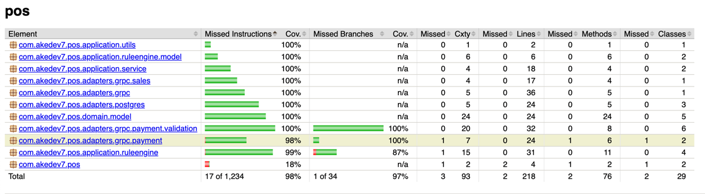

# POS Integration app

This project is a backend service built with **Spring Boot** and **Kotlin**, incorporating powerful tools and frameworks to ensure a clean, efficient, and maintainable architecture. The key technologies used in this project are:

- **Spring Expression Language (SpEL)** – for dynamic value evaluation and condition-based logic.
- **jOOQ** – for typesafe SQL query construction and execution.
- **gRPC** – for efficient inter-service communication using protocol buffers.
- **Flyway** – for managing and versioning database schema migrations.

---

To start the application container, use the following command:

  ```bash
make all
```
This will automatically perform the following tasks:
1. Spin up the PostgreSQL container
2. Run Flyway migrations
3. Generate JOOQ and Protobuf classes
4. Build the Kotlin Spring Boot application
5. Starts the app in Docker

To stop and clean up all the container, use the following command:
  ```bash
make stop
```

---

## How to Send a Request via Postman

To send a request to your gRPC endpoint i.e., localhost:9090, import the protobuf from `src/main/proto/payment.proto` with the additional schema from https://github.com/googleapis/googleapis/ then use the following format for your message.

### Sample Payload of Process Payment request

```json
{
  "customer_id": "1",
  "price": {
    "value": "123"
  },
  "price_modifier": {
    "value": "1"
  },
  "payment_method": "BANK_TRANSFER",
  "datetime": {
    "seconds": 1712121200,
    "nanos": 0
  },
  "additional_item": {
    "fields": {
      "bankName": {
        "string_value": "Bangkok"
      },
      "bankAccount": {
        "string_value": "1234"
      }
    }
  }
}
```

### Sample Payload of Sales Summary request

```json
{
    "end_date_time": {
        "nanos": 0,
        "seconds": "1712131201"
    },
    "start_date_time": {
        "nanos": 0,
        "seconds": "1696192000"
    }
}
```
## Code coverage

You can run the code coverage with the following command:
```bash
make verify
```

The result will be generated under `target/site/jacoco/index.html`




